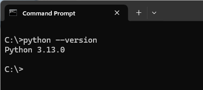
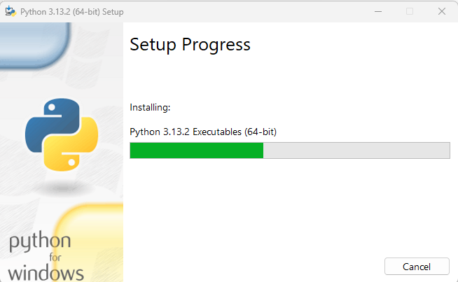

# Everyday Python - Day 001

## Install (or Upgrade) Python

In Windows, run `cmd` to open the terminal (command) window, type `python --version` to check whether your have Python installed, and if yes, what version:



If you want to get latest Python, come to https://www.python.org/, click "Downloads" to download the installation package.

As of today (Feb 18, 2025), I can see the latest version is 3.13.2 for Windows, download the EXE file and double click to install.

Here are the step by step screens for installing the Python

| Step | Screen | Action |
| --- | --- | --- |
| 1 |  | Since I'm now in 3.13.0 already, so choose "Upgrade Now" |
| 2 |  | Installing... |
| 3 |  | When see successful screen, just click `Close` |

Congratulation! You now have the latest Python version!

## Using Python as a Calculator - Numbers

Today's practices are all in Terminal window, so, run `cmd` to open the Terminal (Command).

Let's try some simple Python commands. Start the interpreter and wait for the primary prompt, `>>>`. (This means you're in Python's interpreting mode, comparing to when using VS Code which you'll in Python scripting mode).

For Python, the interpreter acts as a simple calculator: you can type an expression at it and it will write the value. Expression syntax is straightforward: the operator `+`, `-`, `*` and `/` can be used to perform arithmetic; parentheses (`()`) can be used for grouping. Please test follow below example:

```python
>>> 2 + 2
4
>>> 50 - 5 * 6
20
>>> (50 - 5 * 6) / 4
5.0
>>> 50 - 5 * 6 / 4   # see different with or without ()
42.5
>>> 8 / 5 # division always returns a flooting-point number
1.6
```

Note: the `#` starts comment in the line, you don't need type that.

The integer numbers (e.g. 2, 4, 10) have type `int`, the ones with a fractional part (e.g. 5.0, 1.6) have type `float`. Just keep in mind for now, and we'll learn more data type later on.

Division (`/`) always returns a float number. If you want to do `floor division` and get an integer result you may use the `//` operator; to calculate the remainder you can use `%`, let's practice:

```python
>>> 17 / 3      # classic division returns a float nunber
5.666666666666667   # how many "6" here? ;-) That bases on precision level of your computer
>>> 17 // 3     # floor division discards the fractional part
5
>>> 17 % 3      # the % operator returns the remainder of the division
2
>>> 5 * 3 + 2   # floored quotient * divisor + remainder
17
```

With Python, it is possible to use the `**` operator to calculate powers, try here:

```python
>>> 5 ** 2      # 5 squared
25
>>> 2 ** 7      # 2 to the power of 7
128
>>> 25 ** 0.5    # 25 squared root
5.0     # noted the squared root, like division, return floating number
```

The equal sign (`=`) is used to assign a value to a variable (the `variable` will be mentioned later). Afterwards, no result is displayed before the next interactive prompt (`>>>`):

```python
>>> width = 20
>>> height = 5 * 9
>>> width * height
900
```

If a variable is not "defined" (assigned a value), trying to use it will give you an error:

```python
>>> n       # try to access an undefined variable
Traceback (most recent call last):
  File "<stdin>", line 1, in <module>
NameError: name 'n' is not defined
```

There is full support for floating point; operators with mixed type operands convert the integer operand to floating point, try below:

```python
>>> 4 * 3.75 - 1
14.0
```

One more thing before closing today, in interactive mode, the last printed expression is assigned to the variable `_` (underscore). This means that when you are using Python as a desk calculator, it is somewhat easier to continue calculations, practice as below:

```python
>>> tax = 12.5 / 100
>>> price = 100.50
>>> price * tax
12.5625
>>> price + _
113.0625        # equally as price + (price * tax)
>>> round(_, 2)     # now "_" is the latest result
113.06
```

The variable `_` should be treated as read-only by the user. Do not explicitly assign a value to it.

In addition to `int` and `float`, Python supports other types of numbers, such as `Decimal` and `Fraction`, see [Python_Basic_Data_Types](../../Python_Cheatsheet/CheatSheet-Python-2-Basic-Data-Types.pdf) as reference.

Great! You finish the Day 001, see you in [Day 002](../Day002/)!

---
Source: Python Tutorial, [chapter 3.1](https://docs.python.org/3/tutorial/introduction.html)