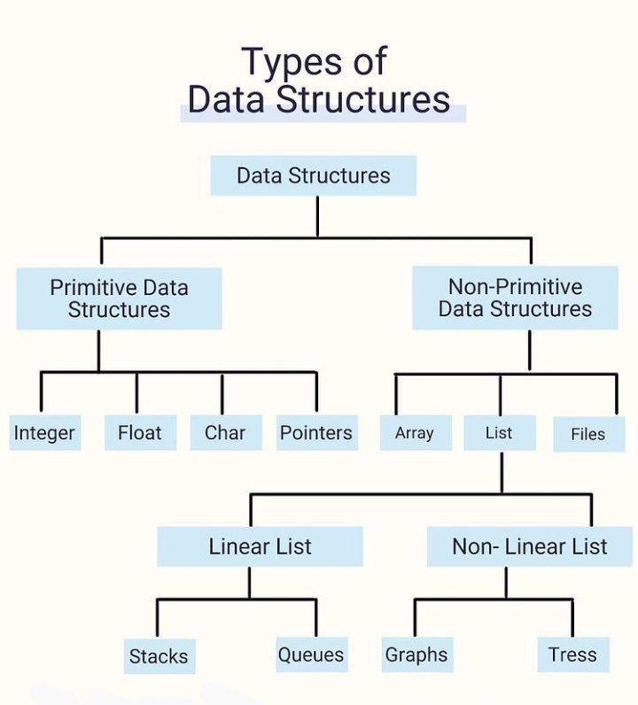

# Everyday Python - Day 002 - Different Kinds of Numbers

We still use Terminal (interpreter mode) and continue of numbers

## Labels: Attaching Names to Numbers (learnt in Day 001 as Variable)

Try this simple example as recap:

```python
>>> a = 3   # (1)
>>> a + 1
4
>>> a = 5   # (2)
>>> a + 1
6
```

At (1), we assign the name `a` to the number `3`. When we ask Python to evaluate the result of the expressions `a + 1`, it sees that the number that a refers to is `3`, and then it adds `1` and displays the output `(4)`.

At (2), we change the value of `a` to `5`, and this is reflected in the second addition operation.

This kind of name is called _variable_, or sometimes you can see it is called _label_, which are inter-exchangeable.

## Different Kinds of Numbers

In [Day 001](../Day001/README.md), we've practiced some kinds of numbers to demostrate the mathematical operations:

- Numbers without a decimal point, which is _integer_.
- Numbers with a decimal point, which is called _floating point numbers_ in mathematics, and _float_ in Python.

Python consider integers and floating point numbers to be different _types_. You may use function `type()` to check which type of the number you give. For example, let's practice:

```python
>>> type(9)
<class 'int'>

>>> type(3.1415)
<class 'float'>

>>> type(9.0)
<class 'float'>
```

Here, please be noted that Python classifies the number `9` as in integer (type 'int') but classifies `9.0` as a floating point number (type 'float'). Although we know that `9` and `9.0` are mathematically equivalent, but in many situations, Python will treat these two numbers differently because they are two different types.

Some programs you'll develop in the future may work properly only with an integer as an input. As just saw, Python won't recognize a number like `1.0` or `4.0` as an integer, so if you want to accept numbers like that as valid inpout in your future programs, you'll have to __convert__ them from floating point numbers to integers. Let's practice this built-in function to test this:

```python
>>>int(3.8)
3
>>>int(3.0)
3
```

The above function `int()` takes the input floating point number, get rid of (not round-up or round-down) anything that comes after the decimal point, and returns the resulting integer.

Below, the `float()` function works similarly to perform the reverse conversion:

```python
>>>float(3)
3.0
```

`float()` takes the integer that was input and adds a decimal point to turn it into a floating point number.

---

## Add-on: Familiar Types of Data Structures in Python



---

Try to use different numbers to more testing, see you next day!

---

Source: "Doing Math with Python" Chapter 1