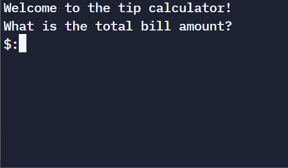

# Everyday Python - Day 004 - Tip and Bill Split Calculator

Today we use the learnt Python data types to develop one bill/tip calculator.

## Concept Practiced

- Python Primitive Data Types: Int, Float, and String (a set of characters)
- Type Error, Type Checking and Type Conversion
- Mathematical Operations in Python
- Number Manipulation and F Strings in Python
- Learn `input()` to get user inputs from keyboard

Note: when you type on keyboard to input characters into program, Python will receive them as `String`, you need to use `int()` or `float()` to convert those inputs into numeric format before doing mathematical operations.

## Effect of the Program



## Source Code

Now use your VS Code, you can open your Python repository and create folder and a file (with `.py` extension) then try below codes:

```python
print("Welcome to the tip calculator!")

bill = float(input("What is the total bill amount?\nBill($):"))
tip = int(input("How much tip percent would you like to give?\nTip%:"))
split = int(input("How many people to split the bill?\nNumber of People:"))

total_1 = (bill * (tip / 100) + bill) / split
print(f"Each person should pay (raw result): ${total_1}")

total_2 = ("{:.2f}".format((bill * (tip / 100) + bill) / split))
print(f"Each person should pay (formatted result): ${total_2}")
print("Each person should pay (formatted result): $", total_2)
```

## Discussion

1. `input()` can include a sentense which will be the prompt displaying on the screen
2. please test and compare the effect between `total_1` and `total_2` by adding the `"{:.2f}`, which is to round result to 2 digits after floating point, you can try to change to other number, e.g. 3f, 1f, ensure to have the `.`
3. when `print`, you can add `f` to have the variable printed into your sentence, with `{}` around variable e.g. `{total_1}`, compare and feel the difference between two type of print on `total_2`

---

Congratulation! Now you have a handy calculator for calculating tip on the bill, play on that and let's move to next day!

---

Source: https://github.com/phillipai/100-days-of-code-python/tree/main/day02