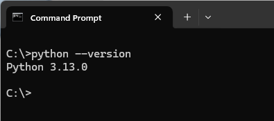
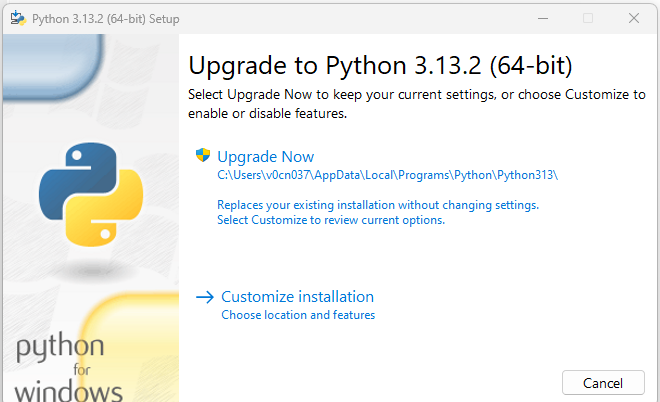
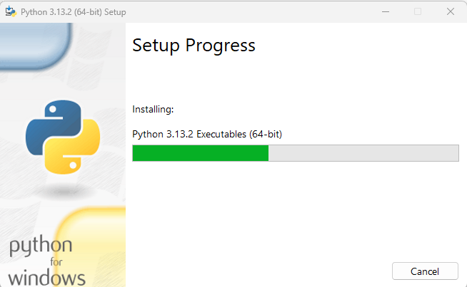
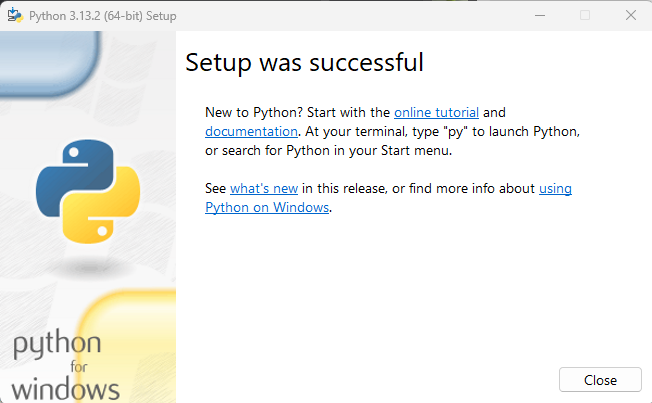

# Everyday Python - Day 001

## Install (or Upgrade) Python

In Windows, run `cmd` to open the terminal (command) window, type `python --version` to check whether your have Python installed, and if yes, what version:



If you want to get latest Python, come to https://www.python.org/, click "Downloads" to download the installation package.

As of today (Feb 18, 2025), I can see the latest version is 3.13.2 for Windows, download the EXE file and double click to install.

Here are the step by step screens for installing the Python

| Step | Screen | Action |
| --- | --- | --- |
| 1 |  | Since I'm now in 3.13.0 already, so choose "Upgrade Now" |
| 2 |  | Installing... |
| 3 |  | When see successful screen, just click `Close` |

Congratulation! You now have the latest Python version!

## Using Python as a Calculator - Numbers

Today's practices are all in Terminal window, so, run `cmd` to open the Terminal (Command).

Let's try some simple Python commands. Start the interpreter and wait for the primary prompt, `>>>`. (This means you're in Python's interpreting mode, comparing to when using VS Code which you'll in Python scripting mode).

For Python, the interpreter acts as a simple calculator: you can type an expression at it and it will write the value. Expression syntax is straightforward: the operator `+`, `-`, `*` and `/` can be used to perform arithmetic; parentheses (`()`) can be used for grouping. Please test follow below example:

```python
>>> 2 + 2
4
>>> 50 - 5 * 6
20
>>> (50 - 5 * 6) / 4
5.0
>>> 50 - 5 * 6 / 4   # see different with or without ()
42.5
>>> 8 / 5 # division always returns a flooting-point number
1.6
```

Note: the `#` starts comment in the line, you don't need type that.

The integer numbers 

---
Source: Python Tutorial, [chapter 3.1](https://docs.python.org/3/tutorial/introduction.html)