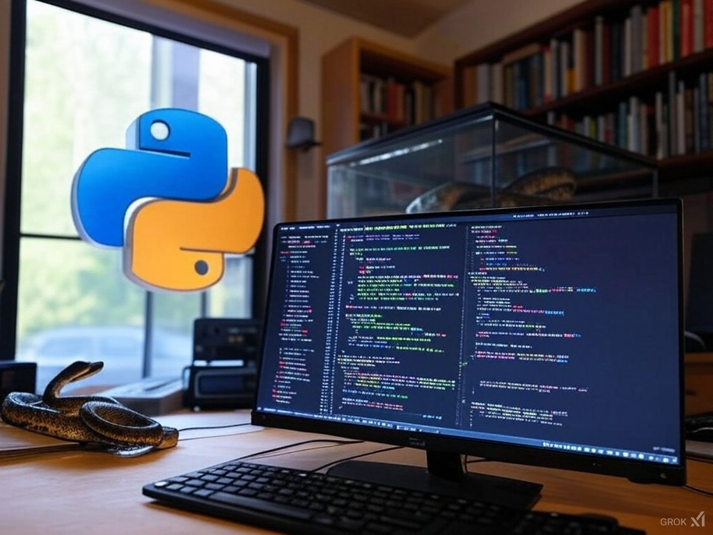

# Everyday Python

Learn and practice Python programming everyday

Key resources:

- [python.org tutorial](https://docs.python.org/3/tutorial)
- Book: Cracking Code with Python (by Al Sweigart)
- Book: Python Crash Course (by Eric Matthes)
- Book: Doing Math with Python (by Amit Saha)
- [100 days of code python](https://github.com/phillipai/100-days-of-code-python)
- [Online Python Training from JP Morgan Chase](https://github.com/jpmorganchase/python-training/)

---

Remember: __Learning is the Journey, not the Destination!__